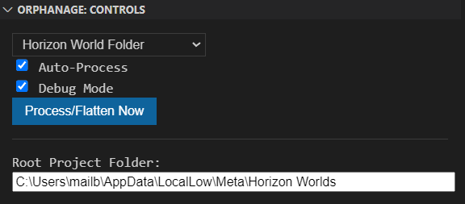

# Orphanage - VSCode Extension

**Orphanage** is a VSCode extension that **flattens** your project files into a single-level directory.

## Table of Contents

1. [Additional Documentation](#additionl-documentation)
2. [Features](#features)  
3. [Installation](#installation)  
4. [Usage](#usage)

## Additionl Documentation

- [Building and Running Tests](./documentation/BuildingAndTests.md)
- [Orphanage Config Layout](./documentation/OrphanageConfigLayout.md)

## Features

1. **Flatten on Demand**  
   - Use the `Orphanage.flatten` command (or “Flatten Project” in the Command Palette) to copy all files from a `sourceFolder` into a `destFolder`.
2. **Auto File Sync**  
   - When you add, edit, or delete files in `sourceFolder`, Orphanage updates only those files in the destination after a short delay.
3. **Import Rewriting**  
   - For `.ts` or `.tsx` files, relative import paths are updated to reflect the flattened file structure (e.g., `../../utils/foo` → `./foo`).
4. **Ignore Certain Imports**  
   - Set an array of patterns (e.g., `node_modules`) in `orphanage.json` to skip rewriting specific import paths.
5. **Compile Flag Processing**:
   - Need some code to disabled and enable based on the destination? You can setup compile flags in the config to strip away code.
6. **Copy From Destination**:
   - Have files automatically copy back to your working space based on your target destination. This can be useful if you need to copy back files to link to.

## Usage

### Extension Panel

The extension provides a side view panel for easy swapping of current destination, and toggling of user preferences.

The Root Project Folder defines where the destinations are relative to. This is defined per user.



### Configuration

1. **Manual Flatten**  
   - Open the **Command Palette** (<kbd>Ctrl+Shift+P</kbd> or <kbd>Cmd+Shift+P</kbd>) and search for **“Flatten Project”** or “**Orphanage.flatten**”.
   - All files in your `sourceFolder` are copied to `destFolder`, with TypeScript imports rewritten if necessary.

2. **Partial Auto-Run**  
   - By default, Orphanage sets up a watcher on your `sourceFolder`.
   - When you create/edit/delete a file, only that file is flattened in the destination folder.
   - This incremental approach is more efficient for large projects than constantly re-flattening everything.

3. **Configuration**  
   - In your workspace root, include a file named `orphanage.json`:

     ```jsonc
     {
         "sourceFolder": "src",
         "destinations": [
            {
               "displayName": "Horizon World Folder",
               "folderPath": "New world_9494984697284707\\scripts\\"
            },
            {
               "displayName": "Destination 2",
               "folderPath": "flattened2"
            }
         ],
         "copyFromDestination": [
            {
               "destinationPath": "types",
               "sourcePath": "types"
            }
         ],
         "compileFlags": [
            "DEBUG_BLOCK"
         ],
         "ignoreFlattenImports": [
            "node_modules"
         ]
      }
     ```

   - If `orphanage.json` is missing, run the **Orphanage.createConfig** command to generate a default config.
   - Checkout [Orphanage Config Layout](./documentation/OrphanageConfigLayout.md) for how this config file is laid out.

## Installation

### A. From VSIX Package

1. Obtain the `.vsix` file (from a release or by building with `vsce package`).
2. In VS Code, press <kbd>Ctrl+Shift+P</kbd> (Windows/Linux) or <kbd>Cmd+Shift+P</kbd> (Mac) → select **“Extensions: Install from VSIX...”**.
3. Browse to and **select** the `.vsix` file.
4. Reload VS Code if prompted.

### B. Embeded in Project

1. Create a folder for the extension in the `.vscode/extensions` directory of your project.<br>
For example `.vscode/extensions/orphanage`

2. Obtain the `.vsix` file (from a release or by building with `vsce package`).

3. Open the VSIX file in a file archiver (i.e 7-Zip)

4. Move (copy) files from the extension directory in the archive into `.vscode/extensions/orphanage` (created earlier on step 1)

5. Open your project in VSCode. If you didn't disable notifications, VSCode will suggest your to install workspace recommended extension. Click on **Install** button. Alternatively, find the extension in the EXTENSIONS list and click Install Workspace Extension.

### C. From Source (Extension Development Host)

1. Clone or download this repo.
2. Open the folder in VS Code.
3. Press <kbd>F5</kbd> to launch a new **Extension Development Host** with Orphanage loaded.
